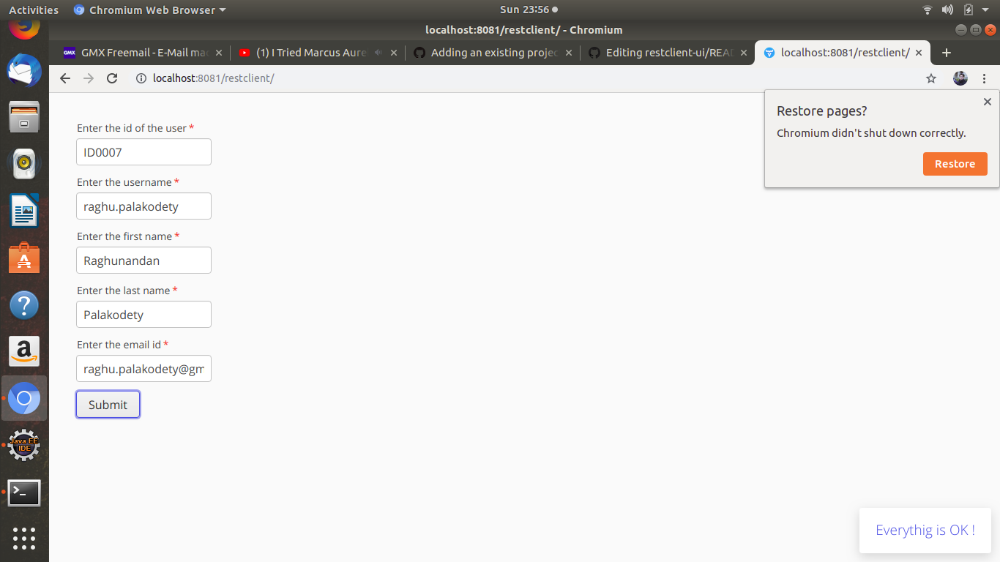

restclient
==============

Front-end using Vaadin framework

UI image
========

Workflow
========

To compile the entire project, run "mvn install".

To run the application, run "mvn jetty:run" and open http://localhost:8080/ .

To produce a deployable production mode WAR:
- change productionMode to true in the servlet class configuration (nested in the UI class)
- run "mvn clean package"
- test the war file with "mvn jetty:run-war"
